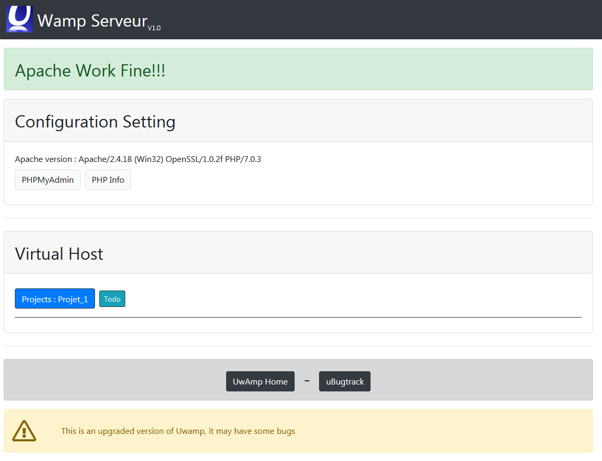
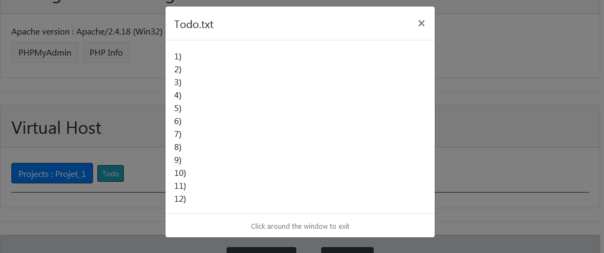

## Uwamp Remake

This is an improvement of Uwamp with new design and features




## 👨🏽‍💻 Laguage used


## Installation

### How to install

Within the download you'll find the following directories and files, logically grouping common assets and providing both compiled and minified variations. You'll see something like this:

```
www/
├── AA-resources/ ## dont touch this
├── project 1
├── project 2
├── index.php ## dont touch this
```

## New feature

### See in the folder
- Create a txt file in your folder with text inside
- Refresh the page
- Click on the button
- Watch your text in a dialog
- For exit click around the dialog

<br>

